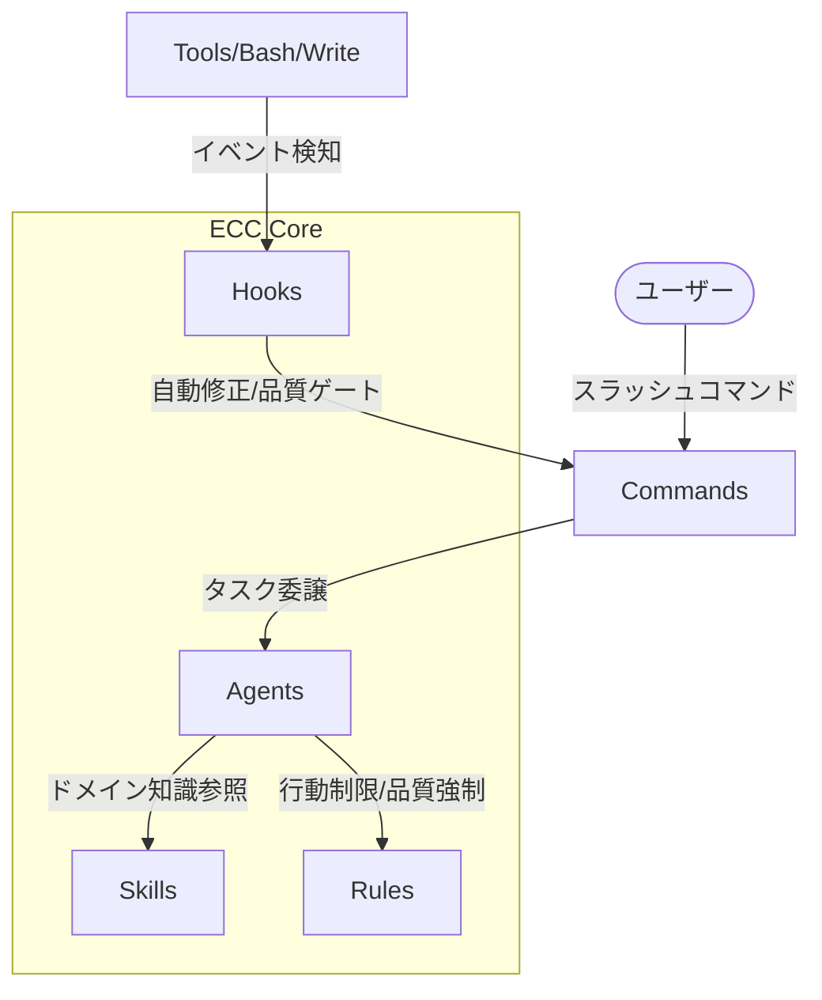

# ECC (Everything Claude Code) 総合インデックス

> **Version**: v2.0.0-rc.1  
> **Status**: Reference Document  
> **Last Updated**: 2026-05-02

ECC (Everything Claude Code) は、AIエージェントによる開発を最適化するための、世界最大級のプロンプト・スキル・ルールライブラリです。このインデックスは、ECCの膨大な資産を「読むだけで8割理解できる」ように整理した、ナビゲーションの起点です。

---

## 🏗 ECC の中核アーキテクチャ

ECCは、単なる「便利なプロンプト集」ではなく、以下の要素が密接に連携する**統合開発ハーネス**です。

### 統計サマリー
- **Agents**: 48種類 (計画、レビュー、各言語専門エージェント)
- **Skills**: 182種類 (ドメイン知識、ワークフロー、AIエンジニアリング)
- **Commands**: 68種類 (スラッシュコマンド経由の自動化)
- **Rules**: 共通10種 + 15言語別の行動指針
- **Hooks**: 20種類以上のトリガーベース自動化
- **Harness**: 8種類のAIツール/IDEへの最適化対応

---

## 📂 インデックス・カタログ

各分野の詳細については、以下の専用インデックスを参照してください。

| インデックスファイル | 内容・役割 |
|-------------------|-----------|
| [01_project-overview.md](./01_project-overview.md) | **プロジェクト思想・5つの設計原則**。ECCがなぜこう作られているか。 |
| [02_agents-index.md](./02_agents-index.md) | **48エージェント詳細**。各専門エージェントの役割と依存関係。 |
| [03_skills-index.md](./03_skills-index.md) | **182スキル詳細**。再利用可能なワークフローとナレッジのカタログ。 |
| [04_commands-index.md](./04_commands-index.md) | **68コマンド詳細**。Command → Agent → Skill の依存チェーン。 |
| [05_rules-index.md](./05_rules-index.md) | **ルール体系**。常に適用される「べからず集」と「推奨事項」。 |
| [06_hooks-index.md](./06_hooks-index.md) | **フック機構**。ツールの実行前後で自動的に行われる品質チェック。 |
| [07_cross-harness-index.md](./07_cross-harness-index.md) | **対応ハーネス**。Claude Code, Cursor, Gemini等の設定差異。 |
| [08_infrastructure-index.md](./08_infrastructure-index.md) | **インフラ・スクリプト**。Schemas, Manifests, CI/CD, Rust制御。 |
| [09_docs-guide-index.md](./09_docs-guide-index.md) | **ガイド・ドキュメント索引**。多言語対応状況と実用ガイド。 |

---

## 🌲 ディレクトリ構造の全体像

ECCリポジトリの直下構成と、それぞれの役割です。

- `agents/`: AIエージェントの「性格」と「能力」を定義（Markdownプロンプト）
- `skills/`: 特定のタスクを遂行するための「手順書」と「知識庫」（Markdown/JS）
- `commands/`: スラッシュコマンド（例: `/plan`）の定義とエージェントへの紐付け
- `rules/`: `common`（共通）と `言語別` の行動ガイドライン
- `hooks/`: ツール使用前後で自動発火するフック設定（`hooks.json`）
- `scripts/`: フックの実体、インフラ、メンテナンス用のJS/Shellスクリプト
- `schemas/`: 設定ファイルやエージェント定義のJSONスキーマ
- `manifests/`: インストール時のプロファイル定義
- `docs/`: アーキテクチャ解説、多言語ドキュメント、比較表
- `examples/`: プロジェクト別の設定テンプレート

---

## 🚀 学習のためのロードマップ

1.  まず **[01_project-overview.md](./01_project-overview.md)** を読み、ECCの「設計思想（5原則）」を理解してください。
2.  具体的な使い方は **[04_commands-index.md](./04_commands-index.md)** でスラッシュコマンドの種類を確認してください。
3.  各コマンドの裏側でどのが動いているかは **[02_agents-index.md](./02_agents-index.md)** で深掘りできます。
4.  自動化の魔法を知るには **[06_hooks-index.md](./06_hooks-index.md)** を見てください。
