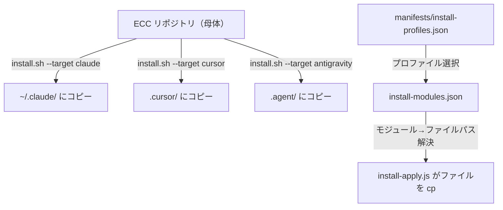
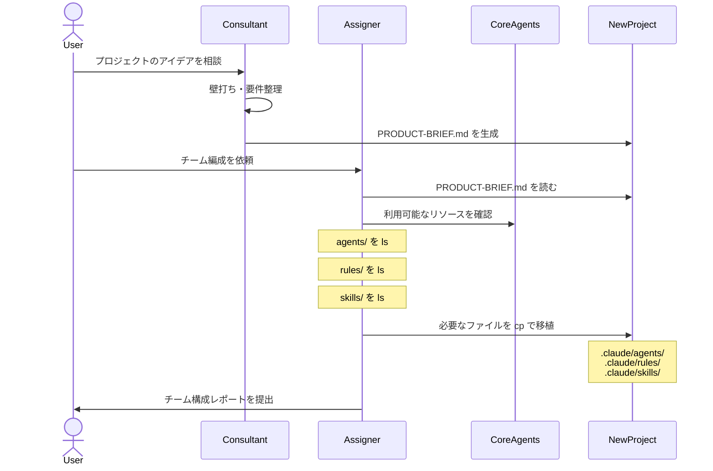

# CoreAgents クロスプロジェクト共有戦略

## 1. 現状把握

### CoreAgents の構成

```
CoreAgents/
├── agents/          ← 8エージェント (consultant, assigner, planner, architect, etc.)
├── commands/        ← 空 (未実装)
├── rules/           ← common/hooks.md, typescript/, web/ (一部空)
├── skills/          ← product-lens/SKILL.md
```

### ECC が採用している方式

ECC は `install.sh` → `install-apply.js` というインストーラーを持っています。



**核心**: ECC の仕組みは「**マニフェスト駆動のファイルコピー**」です。

| レイヤー | ファイル | 役割 |
|----------|---------|------|
| **プロファイル** | `install-profiles.json` | `minimal`, `core`, `developer` 等の構成セット |
| **モジュール** | `install-modules.json` | `rules-core`, `agents-core` 等の単位でファイルパスをグルーピング |
| **実行** | `install-apply.js` | ファイルを対象ディレクトリへコピー |

### 現在の Assigner が既に実現していること

あなたが作った `assigner.md` は、実は **ECC の install.sh を手動で行うエージェント版** です。

```
assigner.md のワークフロー:
1. PRODUCT-BRIEF.md を読む
2. CoreAgents/agents/ を Bash で ls して確認
3. 必要なエージェントを選定
4. cp で .claude/agents/ にコピー
```

> [!IMPORTANT]
> つまり、Assigner は既に「CoreAgents → 他プロジェクトへの移植」の仕組みを持っています。ただし、現在は **agents のみ** が対象で、rules/skills/commands は未対応です。

---

## 2. アプローチ比較

### 方式 A: シンボリックリンク方式

```bash
# 新プロジェクトから CoreAgents を参照
ln -s /path/to/CoreAgents/agents/planner.md .claude/agents/planner.md
ln -s /path/to/CoreAgents/rules/common .claude/rules/common
```

| メリット | デメリット |
|---------|----------|
| CoreAgents を更新すれば全プロジェクトに反映 | パスがマシン固有になる（ポータブルでない） |
| ファイルの重複がない | Git が実体ではなくリンクを追跡する |
| セットアップが最も簡単 | プロジェクト固有のカスタマイズが困難 |

### 方式 B: Assigner cp 方式（現在の方式を拡張）

```bash
# Assigner が cp で移植
cp CoreAgents/agents/planner.md  ./ProjectX/.claude/agents/
cp CoreAgents/rules/common/*     ./ProjectX/.claude/rules/common/
cp CoreAgents/skills/product-lens ./ProjectX/.claude/skills/product-lens/
```

| メリット | デメリット |
|---------|----------|
| プロジェクト独立・ポータブル | CoreAgents を更新しても既存プロジェクトに反映されない |
| プロジェクト固有のカスタマイズが可能 | ファイルの重複が発生する |
| Assigner エージェントが自動で判断・実行 | バージョン管理の仕組みが必要 |

### 方式 C: シェルスクリプトインストーラー方式（ECC 方式の簡易版）

```bash
# CoreAgents/install.sh を作る
./CoreAgents/install.sh --profile minimal --target ./ProjectX
```

| メリット | デメリット |
|---------|----------|
| ECC と同じアプローチで拡張性が高い | 初期構築コストが高い |
| プロファイルで構成を切り替えられる | メンテナンス負荷がある |
| マニフェストで管理できる | 現段階では過剰 |

---

## 3. 推奨: **方式 B（Assigner 拡張）** を段階的に進化させる

> [!TIP]
> 現在のエージェント数（8個）とスキル数（1個）を考えると、方式 C（インストーラー）は過剰です。まずは方式 B を強化し、CoreAgents が成長したら方式 C に移行するのが合理的です。

### 3.1 Phase 1: Assigner の対象範囲を拡張する

現在の Assigner は agents のみをコピーしますが、**rules / skills / commands** もコピーできるように拡張します。

```markdown
### 4. Transplanting (移植) — 現在
cp agents/*.md → .claude/agents/

### 4. Transplanting (移植) — 拡張後
cp agents/*.md     → .claude/agents/
cp rules/common/*  → .claude/rules/common/
cp rules/web/*     → .claude/rules/web/       ← Web プロジェクトの場合のみ
cp skills/*/       → .claude/skills/          ← 要件に応じて選択
cp commands/*.md   → .claude/commands/        ← コマンドがある場合
```

### 3.2 Phase 2: CoreAgents を StudyECC と同等の階層に移動する

```
/Users/yasuvel/
├── CoreAgents/        ← 独立リポジトリとして管理
│   ├── agents/
│   ├── commands/
│   ├── rules/
│   ├── skills/
│   └── README.md
├── StudyECC/          ← 学習プロジェクト
├── ProjectX/          ← 新しい開発プロジェクト
│   ├── .claude/
│   │   ├── agents/    ← CoreAgents から Assigner がコピー
│   │   ├── rules/
│   │   └── skills/
│   └── CLAUDE.md
└── ProjectY/
```

### 3.3 Phase 3: 新プロジェクト立ち上げワークフロー



---

## 4. 具体的な改修ポイント

### 4.1 Assigner の改修案

現在の `assigner.md` に以下を追加:

```diff
 ## Workflow
  ### 1. Requirements Analysis
  現在のディレクトリにある `PRODUCT-BRIEF.md` を読み込みます。
  
  ### 2. Agent Discovery
- `Bash` ツールを使用して、母体プロジェクト（ `/Users/yasuvel/StudyECC/CoreAgents/agents/` ）のディレクトリ一覧を取得し、利用可能なエージェントを確認します。
+ `Bash` ツールを使用して、母体プロジェクトの全リソースを確認します。
+ - エージェント: `$CORE_AGENTS_PATH/agents/`
+ - ルール: `$CORE_AGENTS_PATH/rules/`
+ - スキル: `$CORE_AGENTS_PATH/skills/`
+ - コマンド: `$CORE_AGENTS_PATH/commands/`
 
 ### 3. Team Composition
- 要件に基づいてエージェントを選定します。
+ 要件に基づいてリソースセットを選定します。
   - **コアメンバー (必須)**: `planner.md`, `architect.md`, `tdd-guide.md`, `code-reviewer.md`
+ - **共通ルール (常に適用)**: `rules/common/*`
   - **ドメイン特化 (要件に応じて追加)**: 
     - TypeScriptを使う場合: `typescript-reviewer.md` + `rules/typescript/*`
-   - DB構築がある場合: `database-reviewer.md`
     - セキュリティ要件が高い場合: `security-reviewer.md`
+   - Web フロントエンド: `rules/web/*`
+   - プロダクト企画から始める場合: `skills/product-lens/`
 
 ### 4. Transplanting (移植)
- `Bash` ツールを使用して、選定したエージェントの `.md` ファイルを現在のプロジェクトの `.claude/agents/` にコピー（`cp`）します。
+ `Bash` ツールを使用して、選定した全リソースを現在のプロジェクトにコピーします:
+ - エージェント → `.claude/agents/`
+ - ルール → `.claude/rules/`
+ - スキル → `.claude/skills/`
+ - コマンド → `.claude/commands/`
```

### 4.2 CoreAgents パスの環境変数化

現在、Assigner にはパスがハードコードされています:

```
/Users/yasuvel/StudyECC/CoreAgents/agents/
```

これを **CLAUDE.md 経由で注入** する形に変更します:

```markdown
# 新プロジェクトの CLAUDE.md に記載
## 外部リソース
- CoreAgents パス: `/Users/yasuvel/CoreAgents`
```

または、Assigner 内で環境変数として参照:

```markdown
### 2. Agent Discovery
母体プロジェクトのパスを以下の優先順位で解決します:
1. 環境変数 `CORE_AGENTS_PATH` が設定されている場合はそれを使用
2. CLAUDE.md に記載がある場合はそこから取得
3. デフォルト: `~/CoreAgents`
```

### 4.3 移植記録（トレーサビリティ）

Assigner が移植した際、何をコピーしたかの記録を残すと便利です:

```markdown
<!-- .claude/INSTALL-STATE.md — Assigner が自動生成 -->
# CoreAgents 移植記録

- 移植日時: 2026-05-04
- 母体パス: /Users/yasuvel/CoreAgents
- 移植対象:
  - agents/planner.md
  - agents/architect.md
  - agents/code-reviewer.md
  - agents/tdd-guide.md
  - agents/typescript-reviewer.md
  - rules/common/hooks.md
  - rules/typescript/*
  - skills/product-lens/
```

> [!NOTE]
> これは ECC の `install-state` に相当するものです。CoreAgents が更新された際に「差分があるか」を確認するために使えます。

---

## 5. CoreAgents 独立化のチェックリスト

CoreAgents を StudyECC の外に移動する際のチェックリスト:

- [ ] CoreAgents を `~/CoreAgents` に移動（または `~/CoreAgents` として独立リポジトリ化）
- [ ] `assigner.md` のハードコードパスを環境変数 or デフォルトパスに変更
- [ ] `consultant.md` の出力先（PRODUCT-BRIEF.md）はカレントディレクトリのままで OK
- [ ] `.gitignore` の設定
- [ ] README.md を CoreAgents ルートに作成（利用可能なリソース一覧）
- [ ] 各エージェント内の相互参照パスが相対的であることを確認

---

## 6. まとめ: ECC 方式 vs CoreAgents 方式の対比

| 観点 | ECC | CoreAgents（推奨方式） |
|------|-----|----------------------|
| **移植実行者** | `install.sh` (Node.js スクリプト) | `assigner.md` (AIエージェント) |
| **要件分析** | プロファイル名を指定 (`--profile developer`) | PRODUCT-BRIEF.md をAIが解析 |
| **対象選定** | マニフェスト JSON で静的に定義 | Assigner が要件から動的に判断 |
| **ファイル操作** | `cp` (スクリプト) | `cp` (Bash ツール経由) |
| **記録** | `install-state.json` | `INSTALL-STATE.md`（提案） |
| **更新** | `install.sh` を再実行 | Assigner を再実行 |

> [!TIP]
> **CoreAgents 方式の最大の利点**: 要件文書（PRODUCT-BRIEF.md）からAIが動的にチーム編成を判断するため、マニフェストのメンテナンスが不要です。エージェントが増えても Assigner が自動的に判断します。
